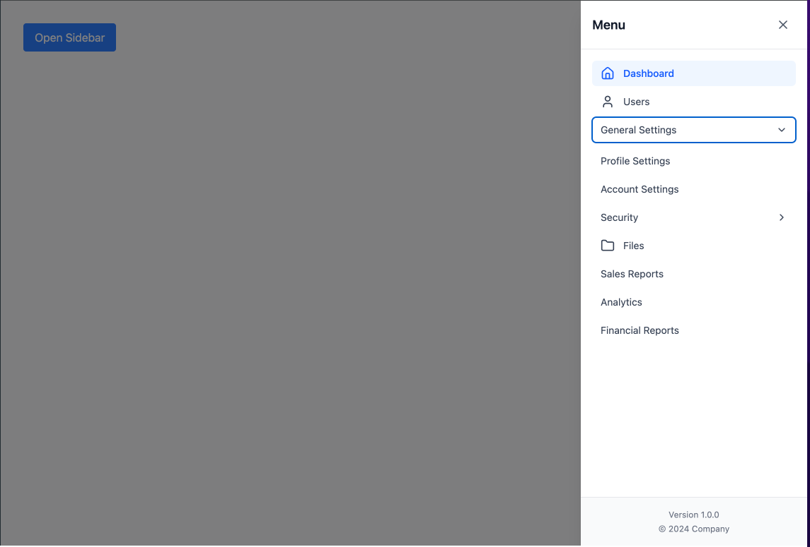

# Storybook Component Library

A modern TypeScript component library built with React, Tailwind CSS, and Storybook. This library provides a collection of reusable, accessible, and beautifully styled components for building web applications.

## Tech Stack

- **React** - UI library
- **TypeScript** - Type safety
- **Tailwind CSS** - Styling
- **Storybook** - Component documentation and development
- **React Hook Form** - Form management
- **Zod** - Schema validation
- **Framer Motion** - Animations
- **Lucide React** - Icons

## Setup Instructions

### Prerequisites

- Node.js 18+ installed
- npm or yarn package manager

### Installation

1. Clone the repository:
```bash
git clone https://github.com/midjiro/storybook-component-library.git
cd storybook-component-library
```

2. Install dependencies:
```bash
npm install
```

3. Start Storybook:
```bash
npm run storybook
```

4. Open your browser and navigate to `http://localhost:6006`

### Development Scripts

- `npm run storybook` - Start Storybook development server
- `npm run build-storybook` - Build Storybook for production
- `npm run dev` - Start Vite development server
- `npm run build` - Build for production
- `npm run lint` - Run ESLint
- `npm run preview` - Preview production build

## Components Overview

### Input

A versatile input component with password visibility toggle and clear functionality.

**Features:**
- Password visibility toggle
- Clear button for easy reset
- Error state styling
- Controlled and uncontrolled modes
- Full TypeScript support

**Usage:**
```tsx
import { Input, Label, ErrorMessage } from '@/components/Input';

<div className="w-full">
  <Label htmlFor="email">Email</Label>
  <Input 
    id="email" 
    type="email" 
    placeholder="email@example.com" 
    error={hasError}
  />
  {hasError && <ErrorMessage>Invalid email</ErrorMessage>}
</div>
```

**Props:**
- `clearable` - Show clear button
- `error` - Apply error styling
- All standard HTML input attributes

**Related Components:**
- `Label` - Form label component
- `ErrorMessage` - Error message display

---

### Toast

A notification system for displaying alerts, messages, and feedback to users.

**Features:**
- Four types: info, success, warning, error
- Configurable positions (top, bottom, left, right, center)
- Auto-dismiss with customizable duration
- Smooth animations with Framer Motion
- Programmatic API with `toast()` function

**Usage:**
```tsx
import { toast } from '@/components/Toast';

// Simple notification
toast({
  message: 'Operation successful!',
  type: 'success'
});

// With title and duration
toast({
  title: 'Error',
  message: 'Something went wrong',
  type: 'error',
  duration: 3000
});
```

**API:**
```tsx
toast({
  message: string;
  type?: 'info' | 'success' | 'warning' | 'error';
  position?: 'top-left' | 'top-right' | 'bottom-left' | 'bottom-right' | 'top-center' | 'bottom-center';
  duration?: number; // milliseconds, 0 = no auto-dismiss
  closeable?: boolean;
  title?: string;
})
```

---

### Sidebar

A flexible, compound component for creating slide-in navigation sidebars.

**Features:**
- Slides in from the right
- Header and footer sections
- Multi-level nested menus
- Independent submenu expansion
- Backdrop click to close
- Smooth animations
- Compound component pattern

**Usage:**
```tsx
import { Sidebar } from '@/components/Sidebar';

const [open, setOpen] = useState(false);

<Sidebar open={open} onOpenChange={setOpen}>
  <Sidebar.Header>
    <h2>Navigation</h2>
  </Sidebar.Header>
  
  <Sidebar.Content>
    <Sidebar.Menu>
      <Sidebar.MenuItem>Home</Sidebar.MenuItem>
      <Sidebar.SubMenu>
        <Sidebar.SubMenuItem id="products" label="Products">
          <Sidebar.SubMenuItem id="electronics" label="Electronics" />
        </Sidebar.SubMenuItem>
      </Sidebar.SubMenu>
    </Sidebar.Menu>
  </Sidebar.Content>
  
  <Sidebar.Footer>
    <p>Footer content</p>
  </Sidebar.Footer>
</Sidebar>
```

**Sub-components:**
- `Sidebar.Header` - Top section
- `Sidebar.Footer` - Bottom section
- `Sidebar.Content` - Scrollable content
- `Sidebar.Menu` - Menu container
- `Sidebar.MenuItem` - Menu item
- `Sidebar.SubMenu` - Submenu container
- `Sidebar.SubMenuItem` - Submenu item

---

### Form Integration

The Input component integrates seamlessly with React Hook Form and Zod validation:

```tsx
import { useForm } from 'react-hook-form';
import { zodResolver } from '@hookform/resolvers/zod';
import { z } from 'zod';
import { Input, Label, ErrorMessage } from '@/components/Input';

const schema = z.object({
  email: z.string().email('Invalid email'),
  password: z.string().min(8, 'Minimum 8 characters')
});

const { register, formState: { errors } } = useForm({
  resolver: zodResolver(schema)
});

<div className="w-full">
  <Label htmlFor="email">Email</Label>
  <Input {...register('email')} id="email" type="email" error={!!errors.email} />
  {errors.email && <ErrorMessage>{errors.email.message}</ErrorMessage>}
</div>
```

## Styling

Components use Tailwind CSS with a light-themed design. All components are fully customizable through className props and follow consistent design patterns.

## Path Aliases

The project uses path aliases for cleaner imports:

- `@/*` - Points to `src/*`

**Example:**
```tsx
import { Input } from '@/components/Input';
import { toast } from '@/components/Toast';
import { cn } from '@/utils/classnames';
```

## 📸 Screenshots

### Input Component

**Basic Input**


**With Clear Button**


**Error State**


**Password Toggle**


**With React Hook Form**


### Toast Notifications

**Success Toast**


**Error Toast**


**Warning Toast**


**Info Toast**


**Multiple Positions**


### Sidebar

**1-Level Menu**


**2-Level Nested Menu**


**3-Level Nested Menu**


**Custom Styled**


## Documentation

Full documentation and interactive examples are available in Storybook. Each component includes:

- Visual examples
- Props documentation
- Usage guidelines
- Code snippets
- Accessibility information


## Acknowledgments

- [Shadcn UI](https://ui.shadcn.com/) - Design inspiration
- [Tailwind CSS](https://tailwindcss.com/) - Utility-first CSS framework
- [Storybook](https://storybook.js.org/) - Component development environment